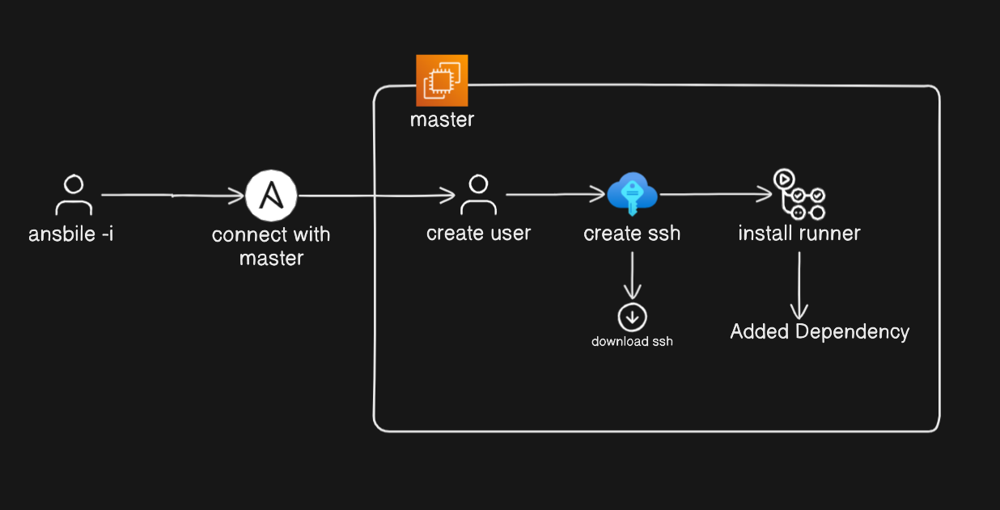

# Automation: Create User & GitHub Actions Runner Setup 🚀

Welcome to the **Automation** repository! This project automates the process of creating a new user on an EC2 instance and configuring GitHub Actions runners with minimal manual setup. If you’re into streamlining your DevOps workflows, you’re in the right place.

---

## Table of Contents
- [About the Project](#about-the-project)
- [Prerequisites](#prerequisites)
- [Workflow](#workflow)
- [Usage](#usage)
- [Repository Structure](#repository-structure)
- [Contributing](#contributing)
- [License](#license)
- [Contact](#contact)

---

## About the Project 📝

This project leverages **Ansible** (either installed locally or within a Docker container) together with a remote EC2 slave to:
- **Create a User with a User Group** on the EC2 instance.
- **Generate SSH Keys** on the EC2 instance, copy the public key to the newly created user's `authorized_keys`, and download the RSA file to a specified local path.
- **Download and Configure GitHub Actions Runners** by adapting settings defined in a YAML file—enabling you to run multiple runners like _admin_ or _backend_ with ease.

The goal is to minimize repetitive manual steps thereby reducing possible human errors, while also making the setup process transparent and efficient.

---

## Prerequisites 🔧

Before you begin, ensure you have the following:
- **Ansible** installed locally or available via a **Docker container**.
- An available **EC2 instance** acting as the slave machine.
- A basic understanding of **bash**, **YAML**, and **Ansible**.
- A valid GitHub token for runner configuration.

---

## Workflow 🤖

1. **User & Group Creation**  
   Create the new user and the corresponding group on the EC2 instance.

2. **SSH Key Generation & Configuration**  
   - Generate the SSH key pair on the EC2 instance.
   - Copy the generated `.pub` key into the new user’s `authorized_keys` file.
   - Download the generated RSA file to your local machine.  
     
     Set the download path by configuring:
     ```yaml
     file_download_path: "/home/tharun/tharun/ansible/Automation/Create_user"
     ```

3. **GitHub Actions Runner Setup**  
   - **Download the Runner:** Fetch the GitHub Actions runner package.
   - **Configure Runners:**  
     Define your runner settings in the file `vars/github-actions.yaml`. First, specify how many and which runners you need:
     ```yaml
     github_actions:
       # Define the GitHub Actions runners you require.
       - "admin"
       - "backend"
     ```
     
     Then, configure each runner. For example, for the **admin** runner:
     ```yaml
     admin:
       github_url: "<your github url>"      # *e.g., https://github.com*
       token: "<Generated token>"            # *replace with your GitHub token*
       runner_name: "<runner name>"          # *a custom name for this runner*
       runner_group: "default"
       runner_labels: "<labels>"             # *comma-separated labels if needed*
       work: "<folder name>"                 # *working directory for the runner*
     ```
     **Important:** Replace all placeholders (e.g., `<your github url>`) with your actual values.

---

## Usage 🚀

To get started, follow these steps:

1. **Clone the Repository:**
   ```bash
    git clone git@github.com:THARUN13055/Automation.git
    cd Automation
    ansible-playbook -i inventory ./plays/setup-all.yaml -vv

---

## Ansible Workflow.!


